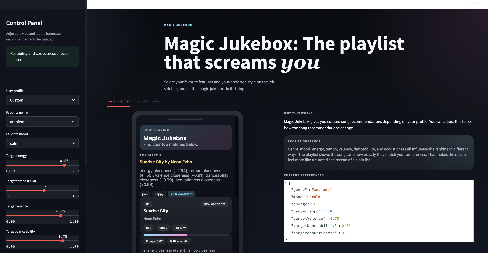
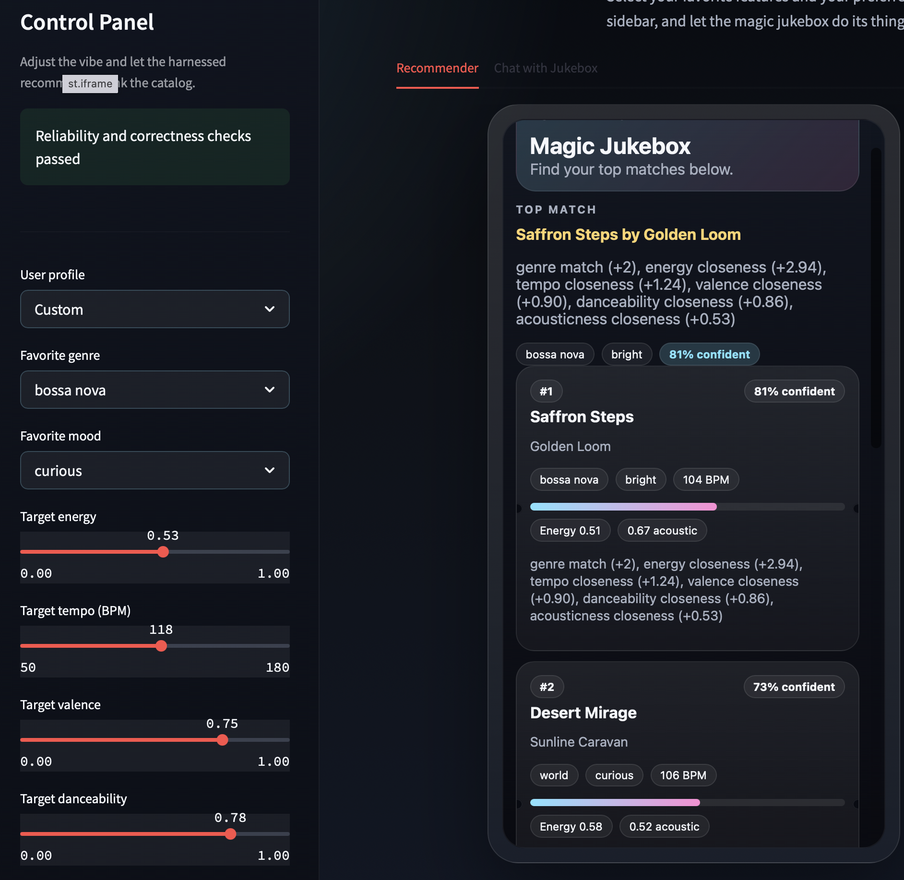
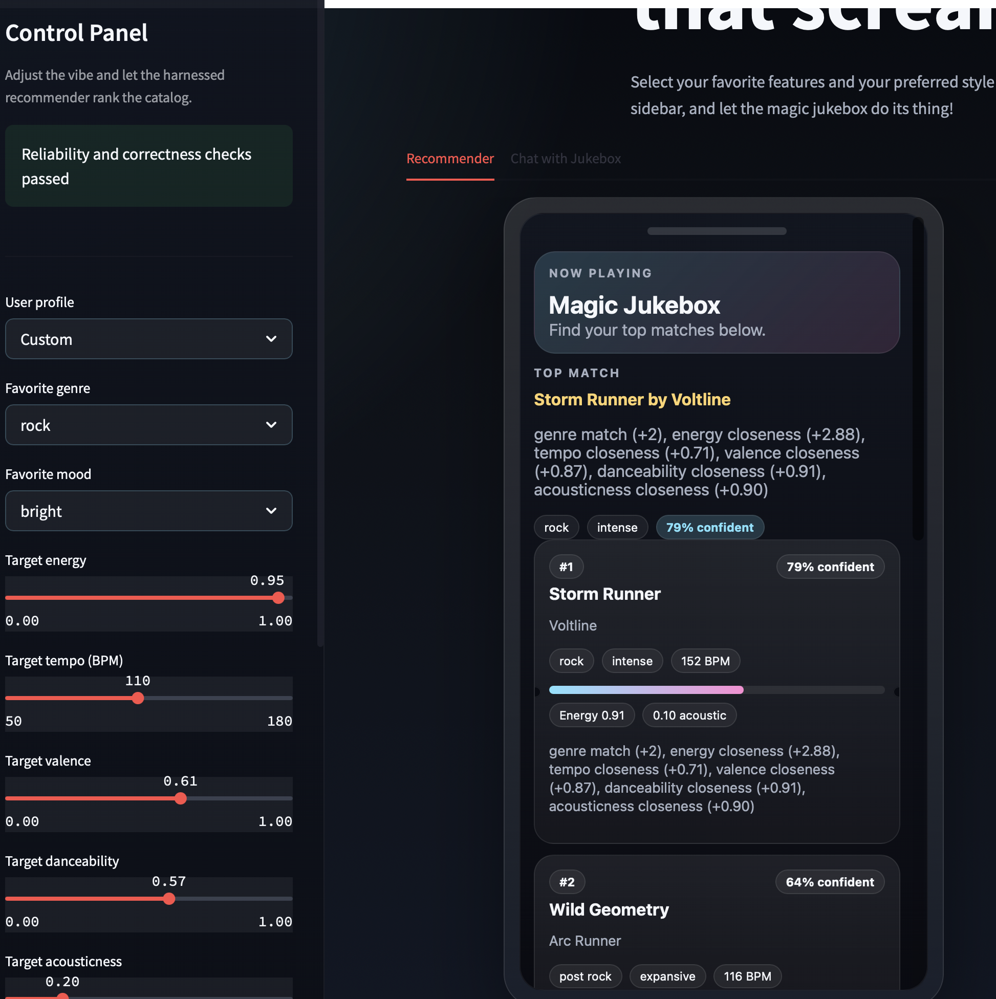
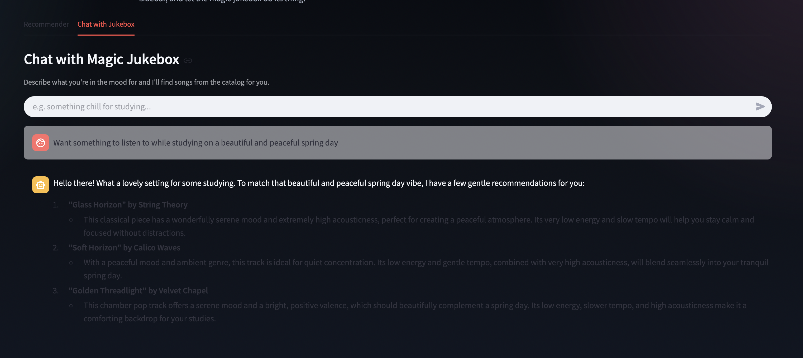

# Magic Jukebox

Magic Jukebox is an extension of the original music recommendation project from module 3. The original goals matched songs to user profiles based on user preferences like genre, mood, and preferences for energy, valency, acoustic-ness and more.

## Extensions

This current project has the following extensions:

- An expanded collection of 50 songs (Synthetic AI-produced) songs
- Reliability and correctness checking that happens before the user is recommended the songs, to ensure the system works
- A chatbot with RAG capabilities that recommends songs from the same dataset, but replies to natural language instead of setting features.

This can be easily used in the form of a streamlit UI. The left part allows easy testing of multiple user profiles, and the main part of the page displays the songs along with why they were matched, as well as confidence scores.

The reason why I built it this way with the UI is because it felt easy to set profile preferences as well view song recommendations in an appealing way. The scrollable mobile view also felt more fun(as well as easy to test if the app was working properly). A chatbot with knowledge of the dataset would be a nice alternative to choosing preferences, in case any user felt that was too mechanical.

A tradeoff I made was some features like mood or genre are much more heavily weighted than the other smaller features, so sometimes, if mood or genre stays the same but the features like target tempo or valency change, the top 5 songs might stay mostly the same(with some change).

The program logic is called "Flowchart.png" in the assets folder.

## Getting Started

### Setup

1. Create a virtual environment (optional but recommended):

   ```bash
   python -m venv .venv
   source .venv/bin/activate      # Mac or Linux
   .venv\Scripts\activate         # Windows
   ```

2. Install dependencies

   ```bash
   pip install -r requirements.txt
   ```

3. Run the app:

   ```bash
   python -m src.main
   ```

### Running Tests

Run the starter tests with:

```bash
pytest
```

You can add more tests in `tests/test_recommender.py`.

### Streamlit UI

Launch the polished phone-style interface with:

```bash
streamlit run app.py
```

If you want to utilise the chatbot with RAG function, please also include your API in the .env file before running the app.

The app reuses the same base scoring logic, but implements a reliability and correctness check as well as chatbot with RAG. The user-input and output functionality is done only after the reliability and correctness checks pass. Now, the app displays the songs in a mobile-device style UI.

## Sample Interactions

Below are three sample interactions. A fourth interaction with the chatbot is also included.

The mobile view is scrollable and contains 5 results. This project is not implemented in UI, but has also been tested using CLI. You can check out the sample user profiles and outputs in the assets folder.






## Testing Summary

I learned about the importance of when you test, and to include it in your program logic if possible. I included a test script called test_recommender as well as another reliability testing step before the program gives the user their recommendations.

## Reflection

Project Demo Link: https://drive.google.com/file/d/1EkD0dwoBewQ1nLCWrrywQRoUaA35P807/view?usp=sharing


This taught me that even with AI, we should design a clear vision for the app, and then take it's help, instead of jumping into suggesions. I liked that we had free reign with what this project could turn into, and that taught me more about taking ownership of your project and trying to make it interesting and fun. Thank you for this project:D !
